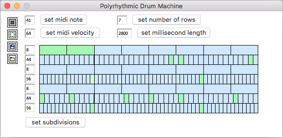

# Polyrhythmic Drum machine

## About

Every drum machine I've ever encountered only lets you subdivide using powers of two (quarter note, 8th note, 16th, 32nd, etc.) and triplets. This is a drum machine that lets you subdivide measures by any number you want!!!!! The drum machine just outputs midi, the same way a hardware midi controller keyboard would, so you can map any midi-triggered drum samples to work with it. The drum machine doesn't handle audio samples, it just outputs midi. You can use a DAW or something to map samples to each midi note.

I'd recommend closing any applications you don't need to have open when running this, because having a bunch of stuff open on your computer will make the **machine** run slow.

Currently the drum machine has literally **no** input validation. If you give it bad text inputs it will throw errors and crash etc.

## Installation:

#### Compressed installation instructions (Mac):

Run these commands in your computer's `terminal` application, one at a time.

         # check if you have python 3
         python3 --version

         # if you don't have python 3, install homebrew
         /bin/bash -c "$(curl -fsSL https://raw.githubusercontent.com/Homebrew/install/master/install.sh)"

         # then install python 3
         brew install python

         # if you already have homebrew and python 3, make sure python 3 is up to date
         brew update
         brew upgrade python3

         # then install mido and python-rtmidi, for python midi support
         pip3 install mido
         pip3 install python-rtmidi

Next, set up a virtual midi port.
   - Open your computer's `Audio MIDI Setup` application.
   - Double click the red box that has the title `IAC Driver`
   - Check the checkbox that says `Device is online`
   - Under `Ports`, make sure there's a port selected called `Bus 1`. If it's not there, add it using the little `+` button.
   - Click `Apply`

This software is designed to be used with some kind of DAW that can map midi input to drum samples. The drum machine works the same way a hardware midi controller keyboard works, outputting midi to the DAW. I arbitrarily use Reason 7's `Redrum` but probably any DAW with built-in midi instruments will work. The drum machine sends its midi output to the virtual midi port, and the DAW takes the virtual midi port as its input device. Just select the virtual midi port you just set up, which should be called `IAC Driver Bus 1`, as your midi input device within your DAW and it should work.

## Running the drum machine

If you've done all the stuff in the `Installation` section, you should be able to type these commands into your computer's `terminal` application to start the drum machine:

    # this is assuming that the drum machine folder is on your desktop
    cd ~/Desktop/drum_machine_5
    python3 drum_machine_5.py

## How to use

I tried to make everything as self-explanatory as possible.

#### Unlabelled buttons

The non-text buttons going down the left side of the drum machine are (from top to bottom):
 - Pause / un-pause
 - Switch between modes: adding new notes, or selecting / editing existing notes
 - Save pattern to file
 - Load pattern from file

#### Midi note and velocity

 - `Midi note` defines the pitch of the midi note to play. Valid pitches are from 0 to 127, with 127 being the highest pitch. I used numbers instead of note names like `C3` out of laziness, sorry about that. Middle C (`C4`)is midi number `60`, for reference, and the C an octave below that (`C3`) is `48`. You can google "midi number to note chart" for a full list, but this shouldn't cause that much trouble since the numbers will be mapped to drum samples anyway, not actual notes.
 - `Midi velocity` defines the volume of the note to play. Valid velocities are from 0 to 127, with 127 being the loudest.

#### Tempo

Normally tempo is defined in terms of beats-per-minute, but with so much freedom to change subdivisions, "beats-per-minute" becomes confusing. Instead, the software measures tempo in terms of the length of the full pattern in milliseconds (`length in milliseconds`). You can do some scratch paper calculations to figure out the number of milliseconds needed for a particular BPM. Currently only integer values are supported for `length in milliseconds`.

#### Other tips and tricks

- You can do some simple math to find useful subdivisions. If you have one row with a subdivision of 4 and you want to set another row to be subdivided into 4 groups of 7, `4 x 7 = 28`; for 4 groups of 11, `4 x 11 = 44`; etc. You can do all sorts of multiplication to find useful subdivisions.

- Sometimes it can be helpful to add blank 'reference rows' with common subdivisions (4, 8, etc.) so that you can easily see how the timing of a more uncommon subdivision lines up with it. If you want to make a row with a subdivision of 44 sound similar to 8th notes, you can add a blank second row with a subdivision of 8 to use as a visual point of reference.

- It might be easier to visualize and keep track of the pattern you're working on if you generally try to stick to using one drum sound (i.e. one pitch) per row. This isn't enforced by the software but I find that it usually makes sense visually and from an organizational standpoint.

#### Save-file format

You can save and load patterns as `.txt` files. Their format will be (anything between brackets `[]` would be replaced with actual data):

    length_in_milliseconds: [length]
    number_of_rows: [number]
    [subdivision of first row] [beat, zero-indexed],[pitch],[velocity] [beat, zero-indexed],[pitch],[velocity] [etc.]
    [... more similar rows ...]
    [subdivision of last row] [beat number, zero-indexed],[pitch],[velocity] [beat number, zero-indexed],[pitch],[velocity] [etc.]

## Editing the code for extra functionality

Some useful functionality hasn't been added to the actual GUI yet, and you can get to it by editing the code itself.

- To change the size of the drum machine display, edit this line (the useful parts are `row_height` and `row_width`):

        678    self.gui_params = GUIParams(box_top_left_x = 80, box_top_left_y = 70, row_height = 20, row_width = 450)

  If you change `row_height` or `row_width`, the size of the application window will be adjusted proportionately without you having to change anything else.

- Output midi to a midi device with a name other than `IAC Drive Bus 1` by editing this line with the name of your midi device:

        32     outport = mido.open_output('IAC Driver Bus 1')
